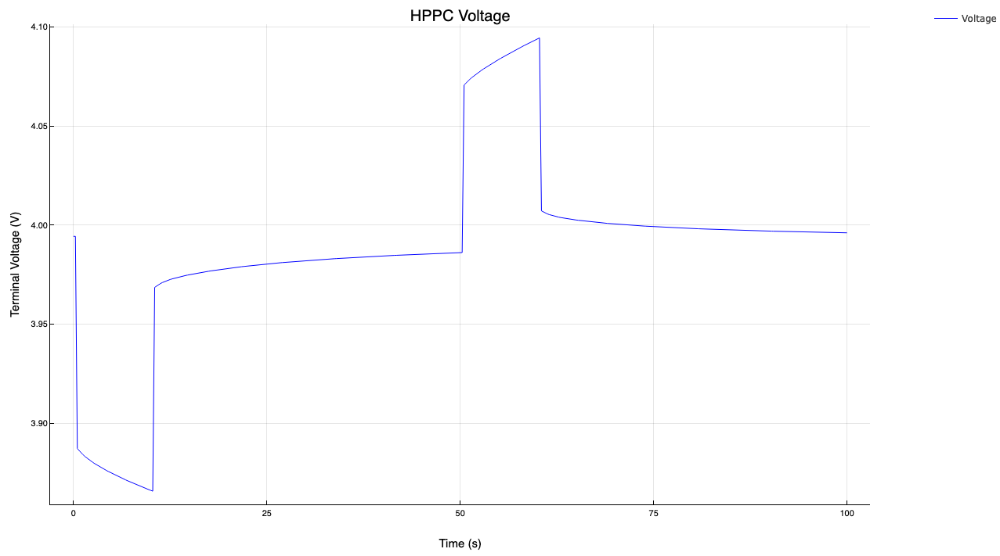
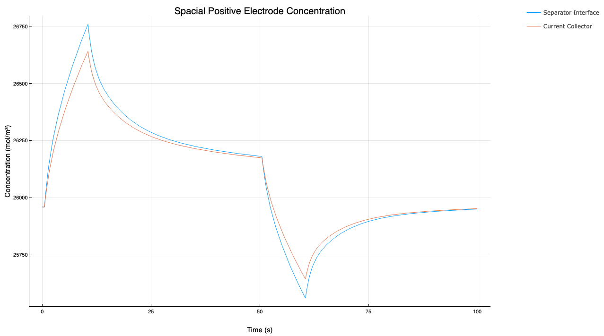

# Lithium-ion Battery Realisation Algorithms (LiiBRA)

[](https://github.com/BradyPlanden/LiiBRA.jl/actions)
[](https://github.com/invenia/BlueStyle)
[](https://github.com/SciML/ColPrac)
[](https://doi.org/10.1016/j.est.2022.105637)

<p align="center">

</p>

## Create and Simulate Reduced Order Lithium-Ion Battery Models
LiBRA provides an open-source implementation of realisation algorithms used for generating reduced-order state-space models. This work aims to develop real-time capable physics-informed models for deployment onto embedded hardware. LiiBRA provides capabilities in offline and online model creation, as well as a framework for lithium-ion degradation predictions. For more information on LiiBRA, and the computationally-informed discrete realisation algorithm (CI-DRA), please refer to the publication above.

Further examples are located in the "examples" directory. Please open an [issue] if you have requests or ideas for additional examples.

Install (Julia 1.7 and later)
-----------------------------

```julia
(v1.7) pkg> add LiiBRA
```

(Type `]` to enter package mode.)

## Example Usage

```julia
using LiiBRA, Plots
```

Setup:
```julia
Cell = Construct("LG M50")
Ŝ = collect(1.0:-0.25:0.0)
SOC = 0.75
Cell.Const.T = 298.15
```

Realisation:
```julia
A,B,C,D = Realise(Cell,Ŝ);
```

HPPC Simulation:
```julia
Results = HPPC(Cell,Ŝ,SOC,4.0,-3.0,A,B,C,D);
```

Plotting Results:
```julia
plotly()
plot(Results.t, Results.Cell_V;
     legend=:topright,
     color=:blue,
     bottom_margin=5Plots.mm,
     left_margin = 5Plots.mm,
     right_margin = 15Plots.mm,
     ylabel = "Terminal Voltage (V)",
     xlabel = "Time (s)",
     title="HPPC Voltage",
     label="Voltage",
     size=(1280,720)
    )
```

<p align="center">

</p>

```julia
plot(Results.t, Results.Ce;
     legend=:topright,
     bottom_margin=5Plots.mm, 
     left_margin = 5Plots.mm, 
     right_margin = 15Plots.mm, 
     ylabel = "Electrolyte Concen. (mol/m³)", 
     xlabel = "Time (s)",
     title="Electrolyte Concentration",
     label=["Neg. Separator Interface" "Neg. Current Collector" "Pos. Current Collector" "Pos. Separator Interface"], 
     size=(1280,720)
    )
```

<p align="center">

</p>

```julia
plot(Results.t, Results.Cseₚ;
     legend=:topright,
     bottom_margin=5Plots.mm, 
     left_margin = 5Plots.mm, 
     right_margin = 15Plots.mm, 
     ylabel = "Concentration (mol/m³)", 
     xlabel = "Time (s)",
     title="Positive Electrode Concentration",
     label=["Current Collector" "Separator Interface"], 
     size=(1280,720)
    )
```

<p align="center">

</p>

```julia
plot(Results.t, Results.Cseₙ;
     legend=:topright,
     bottom_margin=5Plots.mm, 
     left_margin = 5Plots.mm, 
     right_margin = 15Plots.mm, 
     ylabel = "Concentration (mol/m³)", 
     xlabel = "Time [s]", 
     title="Negative Electrode Concentration",
     label=["Current Collector" "Separator Interface"],
     size=(1280,720)
    )
```

<p align="center">

</p>


## Bug Tracking

Please report any issues using the Github [issue tracker]. All feedback is welcome.

[issue tracker]: https://github.com/BradyPlanden/LiiBRA/issues
[issue]: https://github.com/BradyPlanden/LiiBRA/issues
