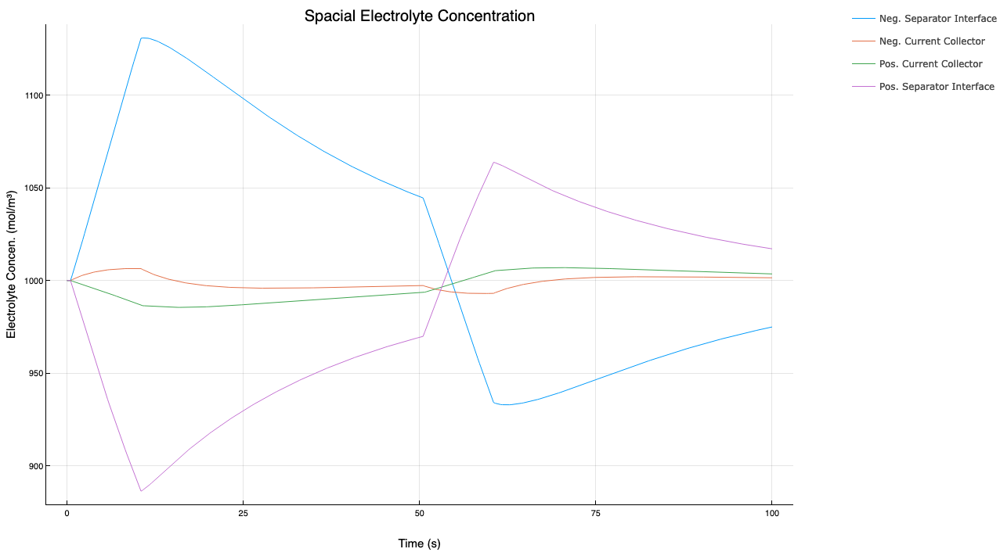

# Lithium-ion Battery Realisation Algorithms (LiiBRA)

[](https://github.com/BradyPlanden/LiiBRA.jl/actions)
[](https://github.com/invenia/BlueStyle)
[](https://github.com/SciML/ColPrac)
[](https://doi.org/10.48550/arXiv.2203.17105)

<p align="center">

</p>

## Create and Simulate Reduced Order Lithium-Ion Battery Models
LiBRA provides an open-source implementation of realisation algorithms used for generating reduced-order state-space models. This work aims to develop real-time capable physics informed models for deployment onto embedded hardware. LiiBRA provides capabilities in offline and online model creation, as well as a framework for lithium-ion degradation predictions. For more information on LiiBRA, and the computationally-informed discrete realisation algorithm (CI-DRA), please refer to the preprint above.

Install (Julia 1.7 and later)
-----------------------------

```julia
(v1.7) pkg> add LiiBRA
```

(Type `]` to enter package mode.)

## Example Usage

```julia
using LiiBRA, Plots
```

Setup:
```julia
Cell = Construct("LG M50")
SList = collect(1.0:-0.25:0.0)
SOC = 0.75
T = 298.15
```

Realisation:
```julia
A,B,C,D = Realise(Cell,SList,T);
```

HPPC Simulation:
```julia
CellV, Ce, jNeg, jPos, RtotNeg, RtotPos, η0, ηL, η_neg, η_pos, ϕ_ẽ1, ϕ_ẽ2, Uocp_Neg, Uocp_Pos, ϕ_e, Cse_Neg, Cse_Pos, Cell_SOC, jeq_neg, jeq_pos, j0, jL, tDra = HPPC(Cell,SList,SOC,4.0,-3.0,A,B,C,D);
```

Plot Results:
```julia
plotly()
display(plot(tDra,CellV, legend=:topright,color=:blue,bottom_margin=5Plots.mm, left_margin = 5Plots.mm, right_margin = 15Plots.mm, ylabel = "Terminal Voltage (V)", xlabel = "Time (s)",title="HPPC Voltage", label="Voltage",size=(1280,720)))
```

<p align="center">

</p>

```julia
display(plot(tDra,Ce, legend=:topright,bottom_margin=5Plots.mm, left_margin = 5Plots.mm, right_margin = 15Plots.mm, ylabel = "Electrolyte Concen. (mol/m³)", xlabel = "Time (s)",title="Spacial Electrolyte Concentration",label=["Neg. Separator Interface" "Neg. Current Collector" "Pos. Current Collector" "Pos. Separator Interface"], size=(1280,720)))
```

<p align="center">

</p>

```julia
display(plot(tDra,Cse_Pos, legend=:topright,bottom_margin=5Plots.mm, left_margin = 5Plots.mm, right_margin = 15Plots.mm, ylabel = "Concentration (mol/m³)", xlabel = "Time (s)",title="Spacial Positive Electrode Concentration",label=["Separator Interface" "Current Collector"], size=(1280,720)))
```

<p align="center">

</p>

```julia
display(plot(tDra,Cse_Neg, legend=:topright,bottom_margin=5Plots.mm, left_margin = 5Plots.mm, right_margin = 15Plots.mm, ylabel = "Neg. Electrode Concen. [mol/m^3]", xlabel = "Time [s]", size=(1280,720)))
```

<p align="center">

</p>


## Bug Tracking

Please report any issues using the Github [issue tracker]. All feedback is welcome.

[issue tracker]: https://github.com/BradyPlanden/LiiBRA/issues
